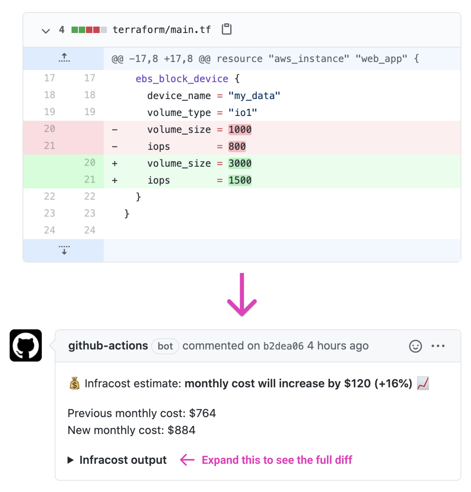

# Infracost CircleCI Orb

This [CircleCI Orb](https://circleci.com/developer/orbs/orb/infracost/infracost) runs [Infracost](https://infracost.io) against the master branch and the pull request. It automatically adds a pull request comment showing the cost estimate difference (similar to `git diff`) if a percentage threshold is crossed.

It supports GitHub and Bitbucket. Since Bitbucket [does not](https://community.atlassian.com/t5/Bitbucket-questions/View-all-comments-on-a-pull-request/qaq-p/677092) show commit comments in the pull request page, the Orb posts a pull request comment if applicable; otherwise it posts a commit comment (only visible in the commit's comments page).

The Orb uses the latest version of Infracost by default as we regularly add support for more cloud resources. If you run into any issues, please join our [community Slack channel](https://www.infracost.io/community-chat); we'd be happy to guide you through it.

As mentioned in the [Infracost FAQ](https://www.infracost.io/docs/faq) you can run `infracost` in your Terraform directories without worrying about security or privacy issues as no cloud credentials, secrets, tags or Terraform resource identifiers are sent to Infracost's Cloud Pricing API. Infracost does not make any changes to your Terraform state or cloud resources.



## Parameters

Infracost can be run with different options depending on the use-case, please read the [usage methods](https://www.infracost.io/docs/#usage-methods) docs, which explains how the following inputs can be used.

### `tfjson`

**Optional** Path to Terraform plan JSON file.

### `tfplan`

**Optional** Path to Terraform plan file relative to 'tfdir'. Requires 'tfdir' to be set.

### `use_tfstate`

**Optional** Use Terraform state instead of generating a plan (default is false).

### `tfdir`

**Optional** Path to the Terraform code directory (default is current working directory).

### `tfflags`

**Optional** Flags to pass to the 'terraform plan' command, e.g. `"-var-file=myvars.tfvars"`.

### `percentage_threshold`

**Optional** The absolute percentage threshold that triggers a pull request comment with the diff. Defaults to 0, meaning that a comment is posted if the cost estimate changes. For example, set to 5 to post a comment if the cost estimate changes by plus or minus 5%.

### `pricing_api_endpoint`

**Optional** Specify an alternate price list API URL (default is https://pricing.api.infracost.io).

## Environment variables

The following environment variables are required. Other supported environment variables are described in the [Infracost docs](https://www.infracost.io/docs/#environment-variables).

If the [Terraform directory method](https://www.infracost.io/docs/#1-terraform-directory) is being used with AWS, `AWS_ACCESS_KEY_ID` and `AWS_SECRET_ACCESS_KEY` should be set.

Terraform Cloud users should follow [this section](https://www.infracost.io/docs/#terraform-cloud-users). Terragrunt users should follow [this section](https://www.infracost.io/docs/#terragrunt-users).

### `INFRACOST_API_KEY`

**Required** To get an API key [download Infracost](https://www.infracost.io/docs/#installation) and run `infracost register`.

### `GITHUB_TOKEN`

**Optional** GitHub token used to post comments (e.g. a Personal access token), needs to have `repo` scope so it can post comments.

### `BITBUCKET_TOKEN`

**Optional** Bitbucket "username:password" used to post comments (e.g. "myusername:my_app_password"), the password needs to have Read scope on "Repositories" and "Pull Requests" so it can post comments. Using a [Bitbucket App password](https://support.atlassian.com/bitbucket-cloud/docs/app-passwords/) is recommended.

### `BITBUCKET_API_URL`

**Optional** Bitbucket API URL, defaults to https://api.bitbucket.org.

## Usage

1. In CircleCI, go to your Project Settings > Environment Variables, and add environment variables for `INFRACOST_API_KEY`, either `GITHUB_TOKEN` or `BITBUCKET_TOKEN`, and any other required credentials (e.g. `AWS_ACCESS_KEY_ID`).

2. Create a new file at `.circleci/config.yml` in your repo with the following content. Use the Parameters section above to decide which options work for your Terraform setup. The following example uses `tfdir` and `tfflags` so it would be the equivalent of running `terraform -var-file=myvars.tfvars` inside the directory with the terraform code.

  ```
  version: 2.1
  orbs:
    infracost: infracost/infracost@0.4.0
  workflows:
    main:
      jobs:
        - infracost/infracost:
            tfdir: PATH/TO/CODE
            tfflags: -var-file=myvars.tfvars
  ```

## Contributing

Pull requests are welcome. For major changes, please open an issue first to discuss what you would like to change.

## Publishing

To publish Orb, you can amend the commit or push another commit with [semver:FOO] in the subject where FOO is 'major', 'minor', or 'patch'. CircleCI will automatically bump the Orb version based on the semver commit.

To indicate intention to skip promotion, include [semver:skip] in the commit subject instead.

## License

[Apache License 2.0](https://choosealicense.com/licenses/apache-2.0/)
